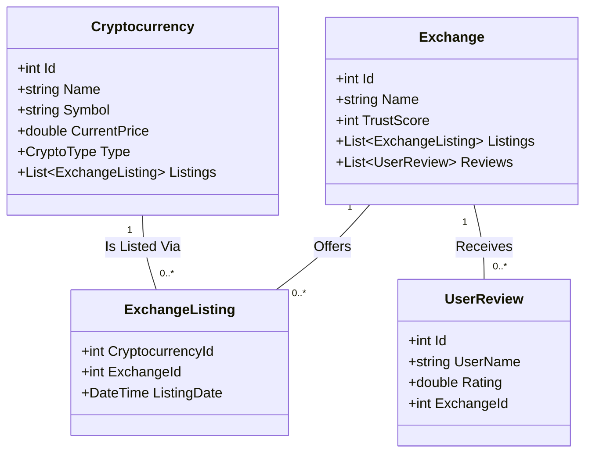

# 📈 CryptoMonitor


**CryptoMonitor** is a robust tracking platform for cryptocurrencies and exchanges. Built with **.NET 9.0**, it demonstrates a clean **N-Layer Architecture** and advanced **Entity Framework Core** patterns, managing complex Many-to-Many relationships between digital assets and trading platforms.

---

## 📷 Demo

> *Dashboard view showing recent Exchange Listings.*


*(Replace this link with a screenshot of your MVC 'Exchange Listings' page)*

---

## ✨ Key Features

* **Asset Management**: Create and track Cryptocurrencies (Coins, Tokens, Stablecoins, MemeCoins).
* **Exchange Tracking**: Manage Exchange details including Trust Scores and Website links.
* **Market Listings (Many-to-Many)**:
    * Link Cryptocurrencies to Exchanges.
    * Track metadata for listings (e.g., *Listing Date*).
    * View recent market additions via the "New Listings" dashboard.
* **User Reviews**: One-to-Many relationship allowing users to rate and review Exchanges.
* **Advanced Filtering**: Filter Exchanges by Trust Score and Name simultaneously using LINQ dynamic queries.
* **Dual Interface**: Includes both a web-based **ASP.NET MVC** interface and a **Console Application** for administrative tasks.

---

## 🏗️ Architecture

The solution follows a strict **N-Layer Architecture** to ensure separation of concerns (SoC) and maintainability:

| Layer | Project | Responsibility |
| :--- | :--- | :--- |
| **Presentation** | `UI.MVC` | ASP.NET Core MVC web interface using Bootstrap. |
| **Presentation** | `UI.CA` | Console Application for quick data testing and admin tasks. |
| **Business Logic** | `BL` | Contains `CryptoManager`. Handles validation logic, filtering rules, and acts as the gatekeeper. |
| **Data Access** | `DAL` | Contains `Repository` and `DbContext`. Manages EF Core queries, Eager Loading (`.Include`), and database transactions. |
| **Domain** | `Domain` | Contains POCO entities (`Cryptocurrency`, `Exchange`) and Enums. |

### Data Model (UML)

The application implements a **Many-to-Many relationship with an intermediate entity** (Scenario 2) to track listing dates.



## 🚀 Getting Started

### Prerequisites
* [.NET 9.0 SDK](https://dotnet.microsoft.com/download/dotnet/9.0)
* IDE: JetBrains Rider, Visual Studio 2022, or VS Code.

### Installation

1.  **Clone the repository**
    ```bash
    git clone [https://github.com/YourUsername/CryptoMonitor.git](https://github.com/YourUsername/CryptoMonitor.git)
    cd CryptoMonitor
    ```

2.  **Restore dependencies**
    ```bash
    dotnet restore
    ```

### Run the Application
The application uses **SQLite**, so no external database server setup is required. The database will be automatically created and seeded with sample data upon first run.

Navigate to the MVC project and run:
```bash
cd CryptoMonitor.UI.MVC
dotnet run
```

### Access the App
Open your browser and navigate to `http://localhost:5000` (or the port shown in your terminal).

---

## 💻 Tech Stack Details

* **Framework**: .NET 9.0
* **ORM**: Entity Framework Core (SQLite Provider)
* **Loading Strategy**: Eager Loading (`.Include()`, `.ThenInclude()`) & Lazy Loading Proxies.
* **Frontend**: Razor Views (.cshtml), Bootstrap 5, jQuery Validation.
* **Patterns**: Repository Pattern, Dependency Injection (DI).

---

## 📄 License

This project is licensed under the **MIT License** - see the [LICENSE](LICENSE) file for details.
